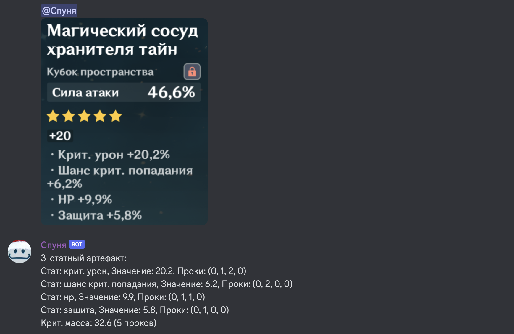
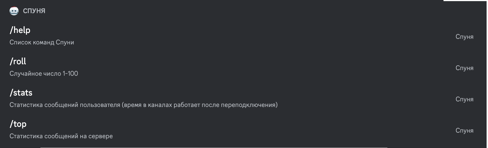

# Spunya
**Spunya (sleepyhead, спуня)** — Genshin Impact themed discord multi-purpose bot working on [discord py](https://discordpy.readthedocs.io/en/stable/api.html).
## List of features
### Artifact rater

Reads GI artifact from image, distinguishes starting stats quantity and calculates stat procs. Currently works only with 20 lvl artifacts.


### Text commands

Calculates chat statistics and performs basic misc actions.

## Launch

1. Setup _config.json_ file.
2. Run with:

```
python3 source/main.py
```
